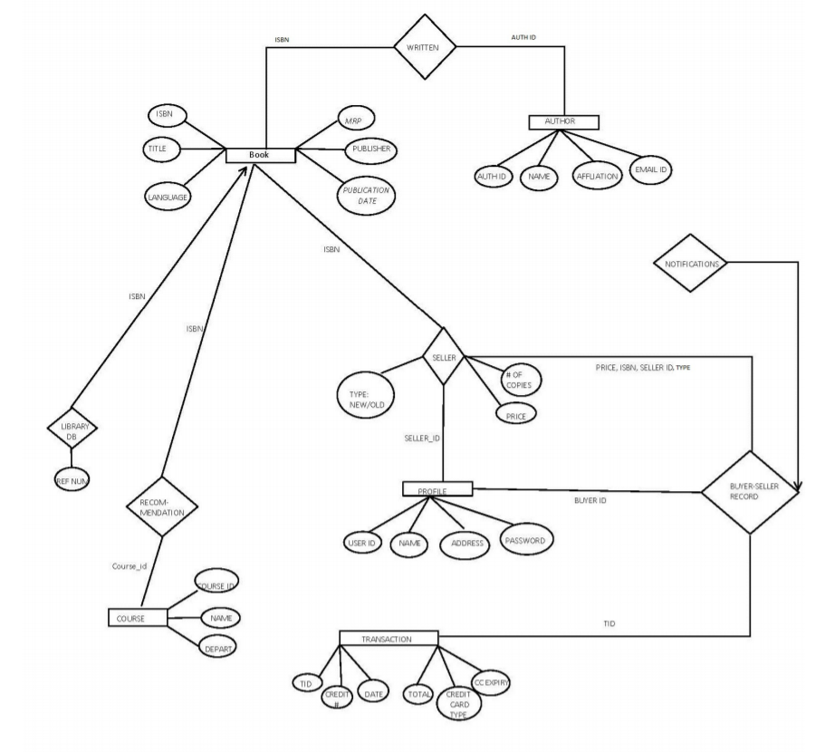
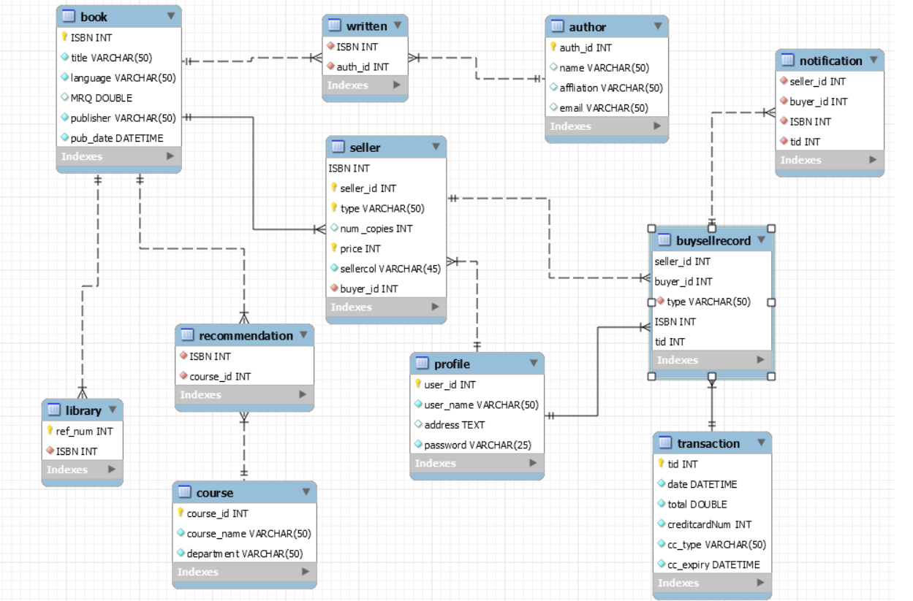

# Book management website

## Đối tượng phục vụ: 
 - Tất cả những ai có nhu cầu mua sách.
 - Chủ website quản lý sách.
## User Stories:
1 trang hiển thị các loại sách theo thể loại.  
Khách hàng: 
- Có thể tìm kiếm tên sách, thể loại, tác giả, ....
- Có thể đọc thử sách.
- Có thể xem các thông tin về sách.
- Đặt mua sách.

Admin:   
- Quản lý sách
- Có thể thay đổi thông tin về sách
- Có thể thêm, xóa sách.
- Hỗ trợ khách hàng.
- Quản lý khách hàng.
             

